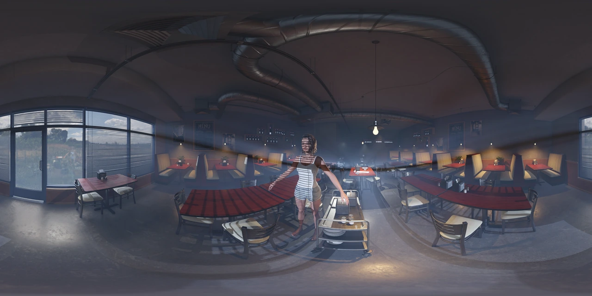



# TRUEODS
### 360° stereo rendering for Unreal Engine.

**English** · [简体中文](README.zh-CN.md)

We build tools for high-resolution **360° ODS and VR180** production — with correct stereo parallax under Lumen, 8K stereo frames in minutes, seamless 360° volumetric fog and linear HDR masters.

[Explore TRUEODS](https://github.com/trueodsofficial/trueods) · [Sample downloads](https://github.com/trueodsofficial/trueods#sample-downloads) · [Quick start](https://github.com/trueodsofficial/trueods/blob/main/docs/QUICKSTART.md#english) · [Get support](https://github.com/trueodsofficial/trueods/blob/main/docs/SUPPORT.md#english)

## From one workstation to a production team

| TrueODS (base edition) | TrueODS Distributed |
| :--- | :--- |
| Complete stereo-panorama rendering for independent creators and single-workstation projects. | Everything in the base edition, plus **Engine-Level Temporal Lock** and **Multi-Machine Rendering** for team production. |

**TrueODS Distributed keeps the scene's timing connected across separately rendered sections.** Multi-Machine Rendering automates configuration checks, frame-range allocation, and output completeness checks; you deploy the project and start or resume rendering on each machine yourself. Unbaked simulations, random or externally driven effects, and lighting or effects that need several frames to settle still need caching, warm-up and a check at each join.

[Compare the editions →](https://github.com/trueodsofficial/trueods/blob/main/docs/EDITIONS.md#english)

## Correct stereo parallax in every direction

[JPG · 26.5 MB](https://github.com/trueodsofficial/trueods/releases/download/samples-20260928/coffee01_00108409.jpg) · [PNG original · 295.8 MB](https://github.com/trueodsofficial/trueods/releases/download/samples-20260928/coffee01_00108409.png)

Ghosting at the top and bottom poles comes from Pole Mono Merge, not a rendering artifact.

A left/right-eye preview of a stereo panorama. [See more renders and output details →](https://github.com/trueodsofficial/trueods#see-the-result)

Environment: [Coffee Shop Environment](https://www.fab.com/listings/a0c7819e-a61d-4a19-8d3b-f0f5e584e6e0) by **Leartes Studios**.

## Stay in touch

- **Documentation:** [TRUEODS product guide](https://github.com/trueodsofficial/trueods)
- **Email:** [trueodssupport@gmail.com](mailto:trueodssupport@gmail.com)
- **Support group:** [Request to join the Telegram support group](https://github.com/trueodsofficial/trueods/blob/main/docs/COMMUNITY.md#english) — email proof of purchase to receive an invitation link by reply.
- **Availability:** [Fab release in preparation](https://github.com/trueodsofficial/trueods/blob/main/docs/CHANGELOG.md#english)
